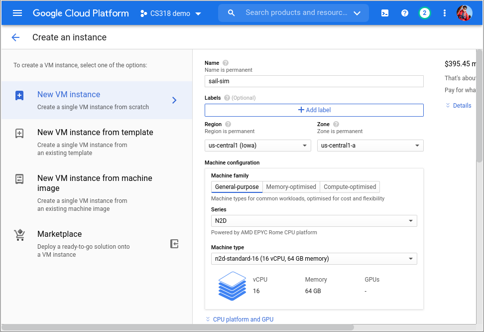
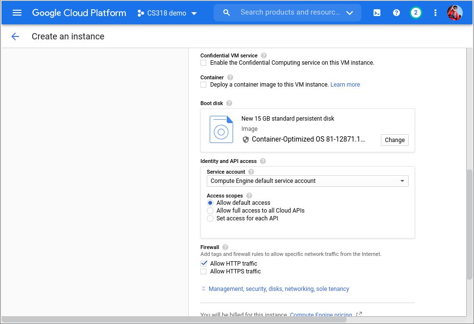
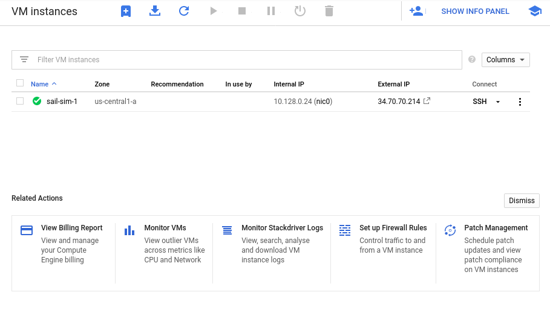

# Cloud Ready Gazebo simulation of a sailing robot

This project contains docker files to build and run an Ardupilot / Gazebo
simulation of a sailing robot. It displays its output on a webpage using Web VNC and is intended for cloud deployments.

Getting this to perform at anything near realtime speeds requires *A LOT* of CPU resources and will cost in region of US $1 per hour. See the performance section for details.


## Quick start

### Running it

```bash
# Pull the docker image from Docker Hub
docker pull colinsauze/sail_sim_docker:latest

# Run the container in the background
# change the first 80 to a different number if you want to use a different port
docker run -d --name sail_sim -p 80:80 colinsauze/sail_sim_docker:latest  

# get the password for VNC
docker exec sail_sim cat /tmp/passwd
```

Open the VNC console in a browser by going to the IP address of the container or localhost if it's on your PC. 


#### Deploying on Google Cloud

You'll need some credit with Google Cloud. New users can get $300 but will have to give a credit card, you aren't charged unless you upgrade to a paid package. 

* Go to Google Cloud console https://console.cloud.google.com/
* Click on the grill menu in the top left corner, choose Computer Engine->VM Instance.

* Click on the plus button in the top middle next to the text "VM Instances" to create a new instance.

* Enter a name for the instance (e.g. sail-sim)
* Choose a machine configuration with at least 8 CPU cores and 2GB of RAM. Don't use a shared core (e.g. e2-micro, e2-small or e2-medium). n2-standard-16 or n2d-standard-16 are recommended, if that's not possible/too expensive try e2-standard-32 



* Under boot disk choose the "Container Optimised OS" version 81 with a 15GB boot disk.


* Tick the "allow HTTP traffic" box under firewall.
* If you want command line SSH access, Click two down arrows next to the the "Management, security, disks, networking, sole tenacny" link, Go to the security tab and paste in your public SSH key
* Click the create button

* Now click the "SSH" link next to the new instance or ssh to its public IP address from your command line (if you added an SSH key), the username specified in the key will have been created on the VM for you.

* Follow the instructions above to download and start the container and get the VNC password.

* Click on the hyperlink to the external IP address to open the VNC webpage, click connect and enter the password.


* You should now see the simulation running. Follow the instructions below to start a demo mission.

* Don't forget to delete the instance when you are done, you will be billed as long as it exists.

## Usage

The simulation launches a number of screens:

- Gazebo
- ArduPilot sim_vehicle.py console
- ArduPilot Rover console
- MavProxy console
- MavProxy map

The [ArduPilot Sailboat](https://ardupilot.org/rover/docs/sailboat-home.html) documentation has a guide to
using sailing vehicles with ArduPilot, in particular the sailing modes and parameter tuning.

The [ArduPilot SITL Simulator](https://ardupilot.org/dev/docs/sitl-simulator-software-in-the-loop.html)
documentation explains how to configure and use the simulator.

### Demo mission

Load the mission way points:

- From the MavProxy console 'Mission' menu select 'Editor'
- Click the 'Load WP File' button and open `/catkin_ws/install/share/rs750_gazebo/config/sailboat_missions.txt`
- Click 'Write WPs' to load them to the flight controller
- At this point you should see the waypoints in the MavProxy map.


Prepare the sailboat:

- In the `sim_vehicle.py` console arm the throttle: `MANUAL> arm throttle force` (to override PreArm EKF calibration warnings)
- Set the mode to auto: `MANUAL> mode auto`

Update the Gazebo wind environment:

- At initialisation the Gazebo environment settings are switched off. Without this the gyro and EFK calibration will not initialise correctly.
- Using the Gazebo sidebar set the wind `linear_velocity.x = 10.0`
- The sailboat should start moving under autopilot control around the triangular course.


## Dependencies

The project depends on the following:

- base docker image: `osrf/ros:melodic-desktop-full`
- marine simulation packages:
  - [asv_wave_sim](https://github.com/srmainwaring/asv_wave_sim.git)
  - [asv_sim](https://github.com/srmainwaring/asv_sim.git)
- robot model:
  - [rs750](https://github.com/srmainwaring/rs750.git)
- sensor plugins:
  - [hector-gazebo-plugins](http://wiki.ros.org/hector_gazebo_plugins)
- modified versions of ardupilot and ardupilot_gazebo:
  - [ardupilot](https://github.com/srmainwaring/ardupilot)
  - [ardupilot_gazebo](https://github.com/srmainwaring/ardupilot_gazebo)

In addition there are a number of maths libraries and hardware acceleration drivers layered into the image. The Dockerfile has the full details.

## Building

```bash
# Clone the repo
git clone https://github.com/srmainwaring/sail_sim_docker.git

# Build the image
docker build -t rhysmainwaring/sail-sim-ardupilot .
```

## Build Status

|    | Melodic |
|--- |--- |
| asv_wave_sim | [](https://travis-ci.org/srmainwaring/asv_wave_sim) |
| asv_sim | [](https://travis-ci.org/srmainwaring/asv_sim) |
| rs750 | [](https://travis-ci.org/srmainwaring/rs750) |


## Performance

Core count, Cloud Provider, GPU type, speed (1.0 = real time)
4 cores, Google Cloud, AMD Rome (n2d-custom), 0.41-0.5
8 cores, Google Cloud, AMD Rome (n2d-custom), 0.59-0.71
16 cores, Google Cloud, Intel Haswell (e2-custom), 0.73-0.8
16 cores, vultr, Intel Cascade Lake, 0.8-0.84
32 cores, Amazon, AMD EPYC 7571, 0.85-0.88


## License
This is free software: you can redistribute it and/or modify it under the terms of the GNU General Public License as published by the Free Software Foundation, either version 3 of the License, or (at your option) any later version.

This software is distributed in the hope that it will be useful, but WITHOUT ANY WARRANTY; without even the implied warranty of MERCHANTABILITY or FITNESS FOR A PARTICULAR PURPOSE. See the GNU General Public License for more details.
